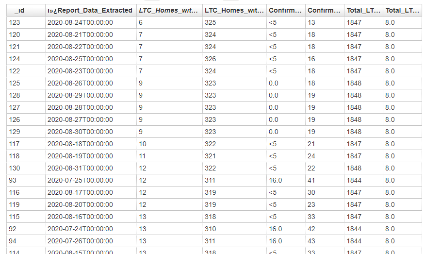
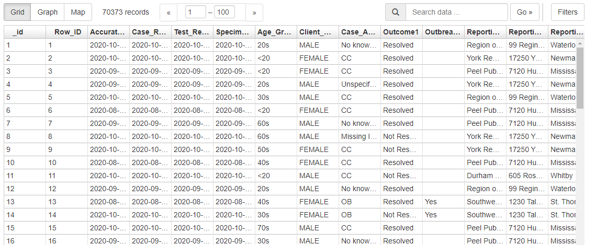
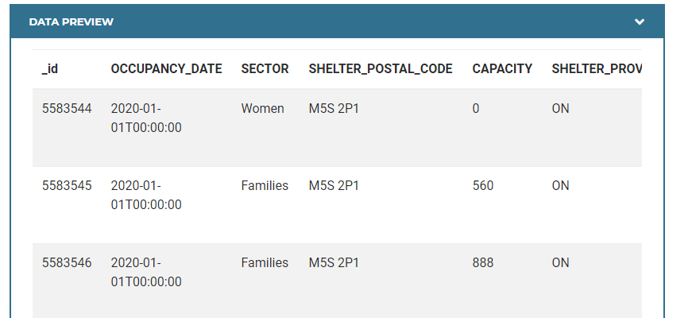
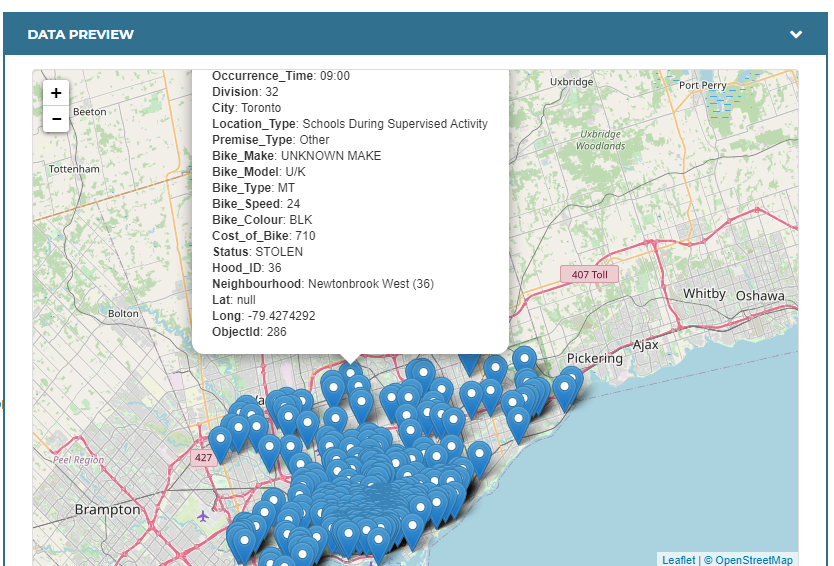
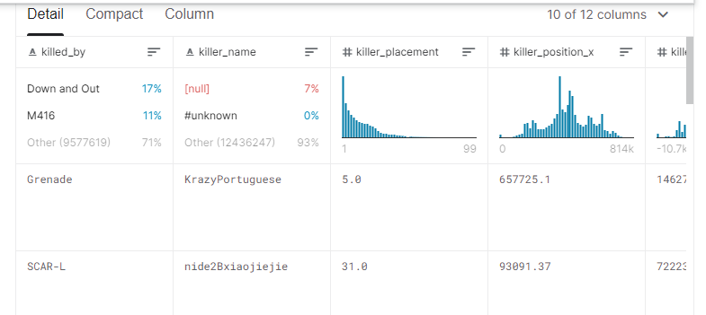

# Data Science 2:  Statistics for Data Science

## Group 16 Members

- 1. Su Wang
- 2. Mabi MAbbayad
- 3. Kira Xue
- 4. Igor Jajcanin
- 5. Daniel Adam Cebula

## Introduction

I have taken the liberty of exploring datasets for us to do one of the following type of analyses in our project:

1. Make a hypothesis about a correlation in a dataset and test the hypothesis using a statistical inference technique (such as the t-test).
2. Build a predictive model using one of the techniques covered in the course, i.e., ordinary least squares regression or Naïve Bayes.

Apparently over the course of this project we will need to:

1. Collaborate with peers to solve a Data Science Problem
2. Work in a group setting to complete a challenge within an agreed-upon time frame
3. Engage with peers to discover their problem-solving process and lessons learned
4. Carry out a statistical analysis using real data
5. Hone Skills in explaining technical details to a non-technical audience

## Potential Group Topics

### 1. [Long-Term Care Home COVID-19 Data - Open Ontario](https://data.ontario.ca/dataset/long-term-care-home-covid-19-data)

- I have attached summarized data from the dataset over the testing of various Long Term Care Homes
- time series analysis? naive bayes?

### 2. [Confirmed positive cases of COVID-19 in Ontario - Open Ontario](https://data.ontario.ca/dataset/confirmed-positive-cases-of-covid-19-in-ontario)

- I have attached all positive cases for COVID that exists in Ontario
- There exists a geojson file as well (maybe we can relate geospatial data)
- Generate statistics on your odds of infection within Ontario
- Maybe model virus movement over time?

### 3. [Toronto Homeless Shelter Daily Occupancy](https://open.toronto.ca/dataset/daily-shelter-occupancy/)

- Check the occupancy of various homeless shelters at points in time
- time series data
- observe if current world events had occupancy effects
- 2017 - 2020 data range

### 4. [Toronto Parking Tickets](https://open.toronto.ca/dataset/parking-tickets/)

- Parking Tickets from 2008 - 2018 at points in time
- time series data
- observe if seasons, months, world events have ticketing differences

### 5. [Toronto Bicycle Thefts](https://open.toronto.ca/dataset/bicycle-thefts/)

- Bicycle Thefts (big thing in Toronto) from 2014 - 2019
- maybe determine the change in geospatial data all bicycle thefts
- current events, months, or seasons could affect bicycle thefts
- We can maybe use Google Maps API to plot data on jupyter notebook

### 6. [PUBG Match Deaths and Statistics](https://www.kaggle.com/skihikingkevin/pubg-match-deaths)

- a little left field but we can look at the data and determine what kind of distribution the different statistics follow
- predict how to ensure your highest survival within the game PUBG
- 4GB but we could just take a subset of it  ~100 MB

